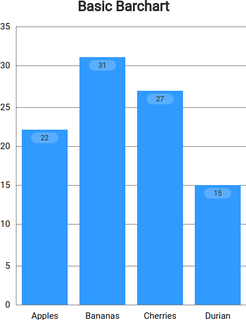
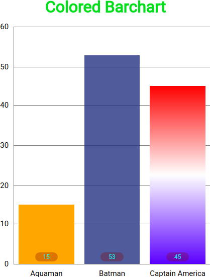
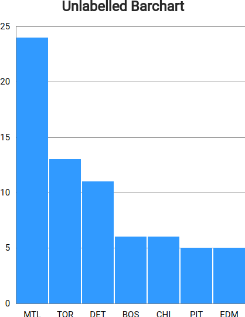

# About
An experimental barchart constructed from JS/JQuery, using CSS Grid. It is a simple embeddable package which provides many options for displaying basic and stackable bar charts.
This project began as an assignment for the Lighthouse Labs bootcamp's Web Development prep course. 

# Screenshots





# Usage
## Setup
Simply save `barchart.js` and `barchart.css` from the `dist/` folder into your project to install the necessary files. Place the following lines in your page's `<head>`:
```html
<script src="barchart.js"></script>
<link rel="stylesheet" href="barchart.css">
  ```
Call the following function from within any `<script>` tag and the chart will render to the DOM element specified:

```javascript
drawBarChart(data, options, element)
```

## Parameters
### Chart `data`
`data` must be given as an array of data objects, each object representing a single column of data. 

Each data object within the array has the following properties:
- `columnLabel` (String): Label to be applied under the column (x-axis)

To create a simple bar (only one value), use the following properties:
- `value` (Integer/Float): the data amount
- `color` (String, *optional, default:* `#0AF`): the bar's color. Can be given as hex value (eg. `'#FA0'`), HTML color name (eg. `'red'`), `'rgba()'`, `'hsla()'`, etc
- `description` (String, *optional*): the text displayed inside the bar (mostly used for multi-bar columns)

To create a multi-bar column (ie. stacked bars), substitute the above `value` property for the following:

- `multiValues` (Array): ordered array (bottom to top) of data objects. Each object in the array uses the same properties as above, ie. `value`, `color`, and `description`. It is recommended to use different colors and give descriptions to help distinguish your data.

Chart axes are automatically generated based on the data given (ie. number of columns, maximum value)


### Chart `options`
`options` are specified as a single object with the following properties. **All parameters are optional**.

- `title` (String): The chart's title text
- `titleFontColor` (String, *default* `'#222'`): Title font color
- `titleFontSize` (String, *default* `'24px'`): Title font size
- `titlePosition` (String, *default:* `'top'`): The title's position. can be `'top'` or `'bottom'`
- `gridlineSpacingY` (Integer/Float): the separation between horizontal lines and y-axis tick labels. If not given, no lines will show except top line
- `barSpacing` (String, *default* `'10px'`): Horizontal padding between bars
- `showDataValueLabels` (Boolean, *default* `true`): Show the bar's numeric value inside the bar
- `showDataDescriptions` (Boolean, *default* `true`): Show the bar's description (if given) inside the bar
- `dataLabelFontColor` (String, *default* `'#222'`): The label's font color
- `dataLabelBgColor` (String, *default* `'#rgba(255,255,255,0.2)'`): The label's background color
- `dataLabelVerticalAlign` (String, *default* `'top'`): The placement of the data label within the bar. Can be `'top'`, `'center'`, or `'bottom'`


### Chart `element`
Id of the element where the chart will be rendered
ie. `element = 'barchart-1'` will render to `<div #barchart-1>`

# Issues
- y-axis labels cannot format decimals/exponentials

# Roadmap
- custom chart element sizing
- scale data to 100% chart height
- build-step minification for distribution
- prefix/suffix units for y-axis labels

# External Resources Consulted
- http://learn.jquery.com
- https://www.w3schools.com/css/css_grid.asp
- https://css-tricks.com/things-ive-learned-css-grid-layout/
- https://www.w3schools.com/cssref/css_units.asp